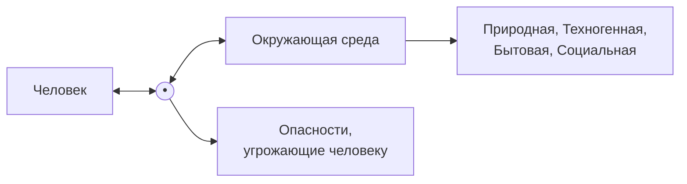
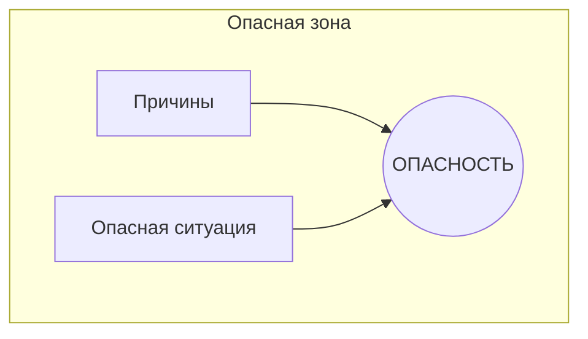
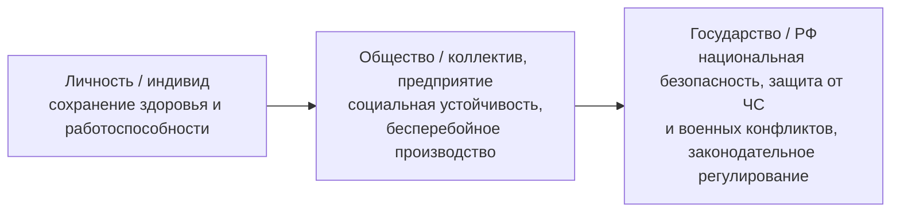
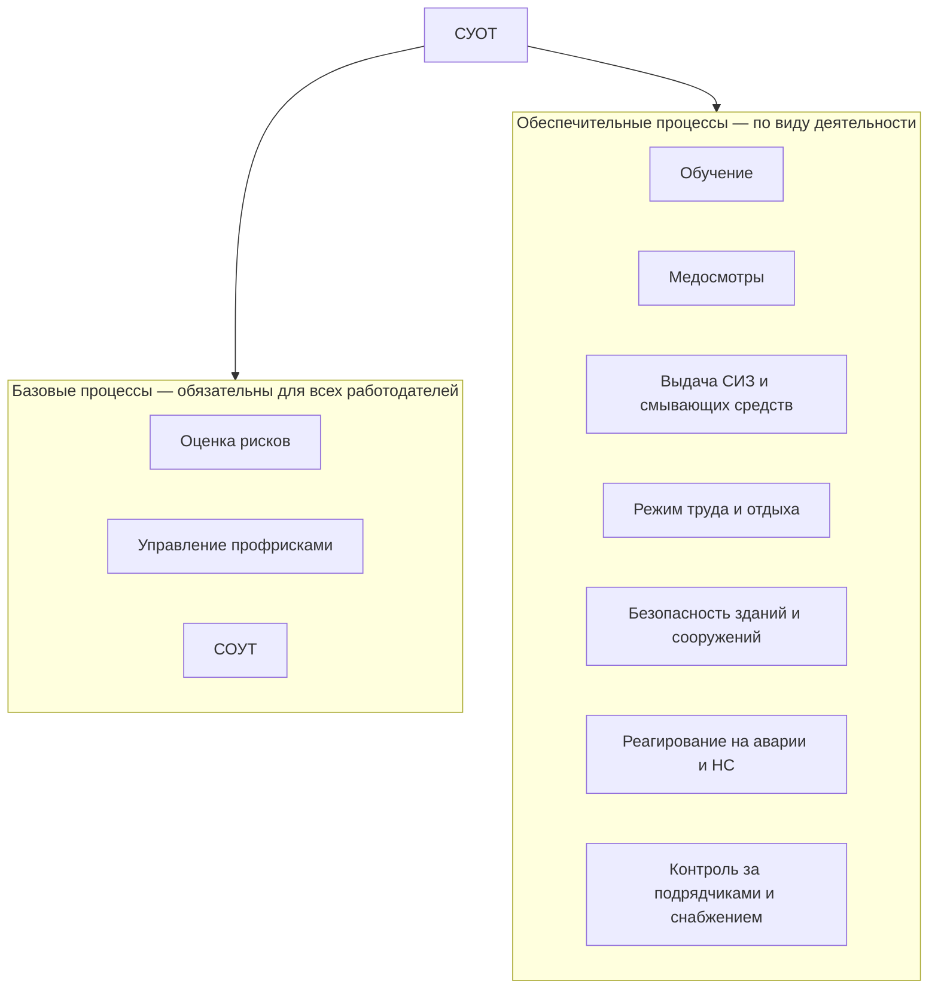
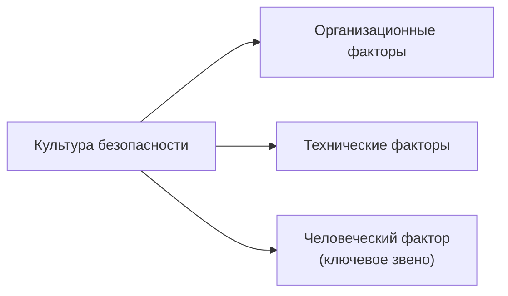

### Модель процесса деятельности человека 

[Понятия Безопасности жизнедеятельности](Понятие%20безопасности%20жизнедеятельности.md) и [Жизнедеятельности как самостоятельного термина](Понятие%20жизнедеятельности.md) - ключевые в ОБЖ
## 1. Теоретические основы безопасности жизнедеятельности

### Факторы и ситуации, оказывающие отрицательное влияние на человека

- Природные факторы
- Природные чрезвычайные ситуации в атмосфере, литосфере, гидросфере
- Техногенные аварии и катастрофы
- Ухудшенные факторы жизнедеятельности вследствие воздействия человека на природу
- Социальные, межнациональные, военные, религиозные конфликты
- Внутренняя среда человека
- Особые психические состояния

### Понятие и классификация опасностей

[[Опасность]] — центральное понятие БЖД.

**По происхождению:**

- Природные
- Техногенные
- Антропогенные
- Экологические
- Биологические
- Социальные

**По характеру воздействия на человека:**

- Механические
- Физические
- Химические
- Биологические
- Психофизиологические

### Особенности опасностей

1. **Вероятностный характер** — невозможно точно предсказать время и место проявления.
2. **Потенциальность (скрытость)** — опасность не всегда видна человеку напрямую.
3. **Перманентность** — риск существует постоянно.
4. **Тотальность** — опасности окружают человека повсюду и угрожают всем.

> Опасности угрожают не только лично человеку, но и обществу и государству. Профилактика опасностей — актуальная гуманитарная и социально-экономическая проблема.

### Аксиомы БЖД

- Любые объекты, процессы, явления потенциально опасны для человека.
- Любая деятельность потенциально опасна для человека.
- Ни в одном виде деятельности нельзя добиться абсолютной [[#Безопасность|безопасности]].
- Безопасность любой системы может быть достигнута с любой степенью вероятности, однако не исключающей существование объекта.

> [[Безопасность]] — это не абсолютная защита, а разумный баланс между риском и мерами по его снижению.

### Возникновение опасной ситуации

[[Опасность]] — центральное звено, окружённое границей опасной зоны: сверху в неё входят причины, снизу — опасная ситуация.

> [[Безопасность]] — это состояние деятельности, обеспечивающее здоровье и жизнь человека с определённой степенью вероятности.

### Система «Личность — Общество — Государство»

Иерархия выстроена как пирамида: вершина — личность, средний уровень — общество, основание — государство.

---

## 2. Иерархия законодательства и нормативная база РФ

### Правовой уровень иерархии законодательства РФ

```mermaid
flowchart LR
    A1["1. Конституция РФ"] --> A2["2. Международные договоры и соглашения РФ"]
    A2 --> A3["3. Федеральные конституционные законы РФ"]
    A3 --> A4["4. Федеральные законы РФ"]
    A4 --> A5["5. Указы и распоряжения Президента РФ"]
    A5 --> A6["6. Постановления и распоряжения Правительства РФ"]
    A6 --> A7["7. Приказы, инструкции, акты федеральных министерств, агентств, служб"]
    A7 --> A8["8. Законодательные акты органов власти субъектов РФ"]
    A8 --> A9["9. Акты органов местного самоуправления"]
```

> Главное правило: нижестоящие акты не должны противоречить вышестоящим.

### Конституция РФ

- **Ст. 7** — РФ — социальное государство, политика направлена на создание условий, обеспечивающих достойную жизнь.
- **Ст. 37** — право на труд в условиях, отвечающих требованиям безопасности и гигиены.
- **Ст. 41** — право на охрану здоровья.
- **Ст. 42** — право на благоприятную окружающую среду.

### Трудовой кодекс РФ

- **Статья 209** — основные понятия ([[Охрана труда]], условия труда, вредный/опасный производственный фактор, безопасные условия труда, рабочее место, СИЗ и др.).
- **Статья 211** — государственное управление охраной труда.
- **Статья 214** — обязанности работодателя создать безопасные условия труда.
- **Статья 215** — обязанности работника в области охраны труда (соблюдать требования ОТ, применять СИЗ, проходить обучение, немедленно сообщать о происшествиях).

### Федеральные законы

- **ФЗ от 28.12.2013 № 426-ФЗ** «О специальной оценке условий труда»
- **ФЗ от 24.07.1998 № 125-ФЗ** «Об обязательном социальном страховании от несчастных случаев на производстве и профессиональных заболеваний»
- **ФЗ от 21.12.1994 № 68-ФЗ** «О защите населения и территорий от чрезвычайных ситуаций природного и техногенного характера»
- **ФЗ от 21.12.1994 № 69-ФЗ** «О пожарной безопасности»

### Приказы Минтруда РФ

- **Приказ Минтруда РФ от 29.10.2021 № 776н** «Об утверждении Примерного положения о системе управления охраной труда ([[СУОТ]])».
- **Приказ Минтруда России от 29.10.2021 № 766н** «Об утверждении Правил обеспечения работников средствами индивидуальной защиты и смывающими средствами».
- **Приказ Минтруда РФ от 31.01.2022 № 36** «Об утверждении Рекомендаций по классификации, обнаружению, распознаванию и описанию опасностей».
- **Приказ Минтруда РФ от 29.10.2021 № 772н** «Об утверждении основных требований к порядку разработки и содержанию правил и инструкций по охране труда, разрабатываемых работодателем».

### Иные нормативно-технические документы

- **ГОСТ 12.0.003-2015** — Опасные и вредные производственные факторы. Классификация.
- **ГОСТ 12.4.026-2015** — Цвета сигнальные, знаки безопасности и разметка сигнальная.
- **СанПиН 1.2.3685-21** — «Гигиенические нормативы и требования к обеспечению безопасности и (или) безвредности для человека факторов среды обитания».
- **СП 52.13330.2016** — Свод правил. Естественное и искусственное освещение. Актуализированная редакция СНиП 23-05-95.
- **СП 542.1325800.2024** — Защитные ограждающие конструкции от беспилотных летательных аппаратов. Правила проектирования.

---

## 3. Организационный уровень и управление на предприятии

### Система управления охраной труда (СУОТ)

[[СУОТ]] — комплекс взаимосвязанных и взаимодействующих между собой элементов, устанавливающих политику и цели в области охраны труда у конкретного работодателя, и процедуры по достижению этих целей.

> Работодатель обязан обеспечить создание и функционирование системы управления охраной труда.

**Приказ Минтруда № 37 от 31.01.2022** «Рекомендации по структуре службы охраны труда и численности работников» определяет, сколько специалистов по ОТ нужно предприятию (в зависимости от численности, условий труда и других параметров).

### Схема структуры СУОТ

### Локальные документы предприятия

**Организационно-правовые:**

- Политика в области охраны труда
- Положение о СУОТ
- Положение о службе охраны труда
- Коллективный договор (раздел по охране труда)
- Правила внутреннего трудового распорядка

**Управленческие (по процессам):**

- Программы инструктажей и обучения по охране труда
- Инструкции по охране труда (по должностям и видам работ)
- Положение об управлении профессиональными рисками
- Перечень профессий для медосмотров и график их проведения

**Учётно-отчётные:**

- Журналы регистрации инструктажей
- Личные карточки выдачи СИЗ
- Журнал учёта несчастных случаев на производстве
- Акты расследования несчастных случаев
- Протоколы проверки знаний требований охраны труда
- Журнал/бланки нарядов-допусков для работ повышенной опасности

---

## 4. Поведенческий уровень и культура безопасности

### Культура безопасности: поведенческий уровень

[Культура безопасности](Культура%20безопасности.md) — это набор характеристик и особенностей деятельности организаций и поведения отдельных лиц, который устанавливает, что проблемам безопасности АС (атомных станций / производств), как обладающим высшим приоритетом, уделяется внимание, определяемое их значимостью (INSAG-4).

### Схема факторов культуры безопасности

### Элементы культуры безопасности

Развитие элементов — от базового к высшему:

### Цепочка формирования личной ответственности

