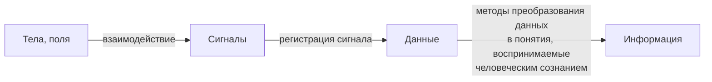

### Виды [информации](Понятие%20информации.md): 
* Сообщение
* [[Уменьшаемая информация]]
* [[Информация как способ передачи]]
* Данные как результат организации символов, объединенных в соответсвии с установленными правилами
* Информация как продукт взаимодействия данных и адекватных им данных
* Информация как сведения о чем либо 

### Формы отображения информации
* Сознание
* Психика
* Раздражимость
* Запечатление взаимодействия

> **Понятие информации предполагает наличие 2 объектов : источника и приемника.**

### Структура формирования информации

