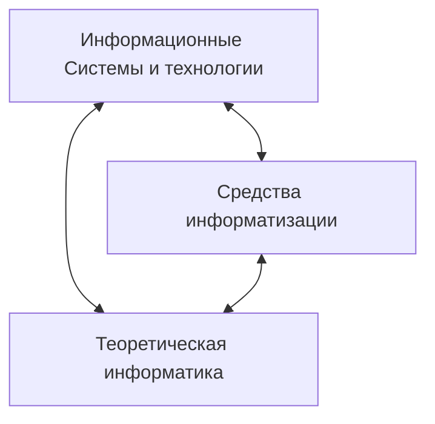

### Основные направления государственной политики в области [информатизации](Информатизация%20общества.md):

1. Обеспечение условий для развития и защиты всех форм собственности на [информационные ресурсы](Информационные%20ресурсы.md).
2. Формирование и защита информационных ресурсов.
3. Cоздание и развитие федеральных и региональных [информационных систем](Информационные%20системы.md) и сетей, обеспечение их совместимости и взаимодействия в едином информацонном пространстве.
4. Создание условий для качественного и эффективного информационного обеспечения граждан, администратиных органов, производственных объединений, а также организаций и общественных объединений на основе государственных информационных ресурсов.
5. Содействие формированию рынка информационных ресурсов, услуг, информационных систем, [технологий](Технология.md) и средств их обеспечения 
6. Формирование и осуществление единой научно-технической и промышленной политики в сфере информатизации с учетом современного мирового уровня развития информационных технологий. 
7. Создание и совершенствование системы, привлечение инвестиций, и механизмов стимулирования разработки и реализации проектов информатизации.
	([[Компьютеризация]])
8. Развитие законодательства в сфере информационных процессов, информатизации и защиты информации. 

--- 

>*Научным фундаментом процесса информатизации является [[Информатика]], ее задачи - создание новых информационных [технологий](Технология.md) и систем для решения задач информатизации*

### Основными компонентами информационных технологий служат:

- Сбор данных (первичной информации).
- Обработка данных.
- Получение результативной [информации](Понятие%20информации.md) и передача ее потребителю.

---
### Структура [информатики](Информатика.md) и ее связь с другими науками

  - Теоретическая информатика
  - Средства информатизации 
  - Информационные системы и технологии

Средства информатизации делятся на технические (средства обработки информации, средства передачи информации, средство хранения информации и средство представления информации) и програмный (программное обеспечение , инструментарий технологий программирования и пакеты прикладных программ)

Информационные системы и технологии