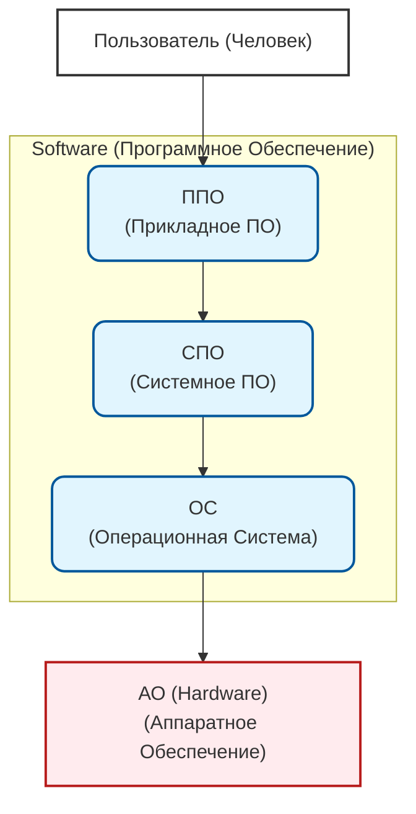

### Структура информатики 
###### [[Информатика]] - наука изучающая :
1. Методы реализации [информационных процессов](Информационный%20процесс.md) средствами вычислительной техники (СВТ)
2. Состав, структуру, общие принципы функционирования СВТ
3. Принципы управления СВТ

### Переход к аппаратному обеспечению 
Джонн Фон Нейман Сформулировал основные принципы построения ЭВМ:
1. Основными блоками машины являются:
	- Арифметико Логическое Устройство (АЛО)
	- Устройство Управления (УУ)
	- Запоминающее устройство (ЗУ)
	- Устройство Ввода Вывода (УВВ) //std::io
2. Программы и данные хранятся в одной и той же памяти (принцип совместного хранения программ и данных в памяти компьютера) 
3. АЛУ и УУ обычно объедененные в центральный процессор (ЦП) определяют действия подлежащие выполнению путем считывания команд из оперативной памяти. 
4. Внутренний код машины двоичен