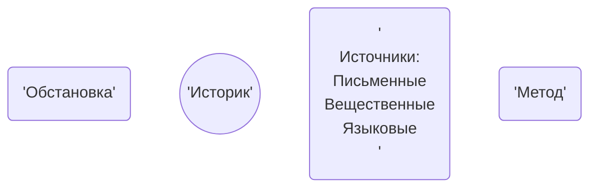

#### Тематическая структура лекции : 
1. Введение в курс
	1.[[#Предмет и функция]].
	1. Периодизация.
	2. Древность.

>*"Природа страны это сила которая держит колыбель народа"*
>*"История начинается на Востоке"*
>*"Человек - разумное существо, но к человечеству это не относится"*

---

### Предмет и функция
[[История]] :
1. Изучает причинно следственную связь событий.
2. Интегральная, касается всех дисциплин.
3. Первый историк - Герадот.
Технология написания истории:

Историк пишет под действием окружающей обстановки 