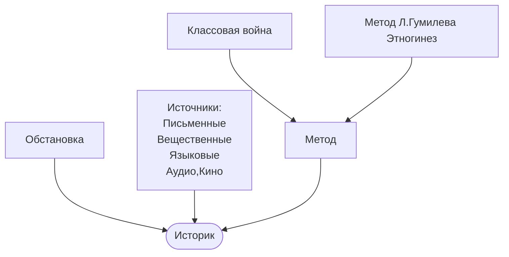
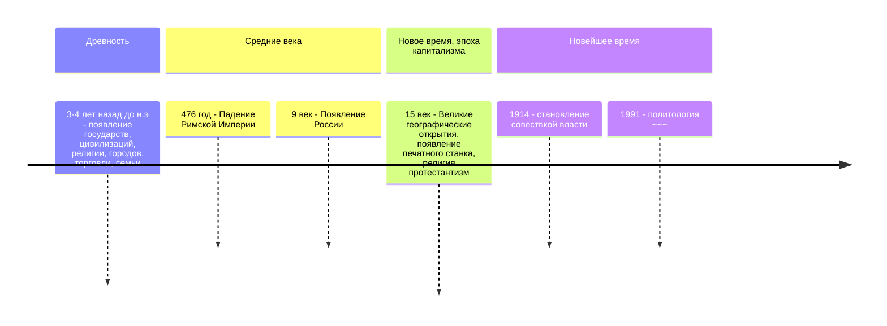

#### Тематическая структура лекции : 
1. Введение в курс
	1. [[#Предмет и функция]].
	2. [[#Периодизация]].
	3. Древность.

>*"Природа страны это сила которая держит колыбель народа"*
>*"История начинается на Востоке"*
>*"Человек - разумное существо, но к человечеству это не относится"*

---

### Предмет и функция
[[История]] :
1. Изучает причинно следственную связь событий.
2. Интегральная, касается всех дисциплин.
3. Первый историк - Герадот.

**Технология написания истории:**

**Функции истории:**
- Познавательная, когнитивная.
- Мировозренческая.
- Социальная память (память народа).

---
### Периодизация 

Периоды России 
1. 882 - 1097 Единое государство со столицей Киев
2. 12 век - 1462(1480) Раздробление , Княжества , Удельный период
3. Московская русь 1480 - 1720 - становление Империей
4. Имперский период 1721 -1917 