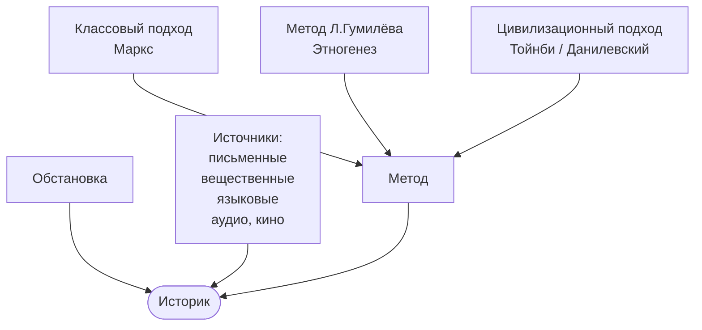
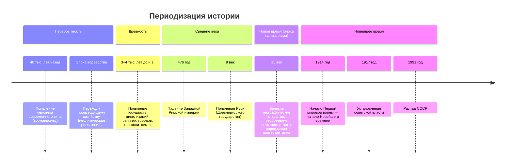

### Введение в курс

1. [Предмет и функция](#Предмет и функция)
2. [Периодизация](#Периодизация)
3. Древность

> «Природа страны — это сила, которая держит колыбель народа»
> — С.М. Соловьёв

> «История начинается на Востоке»
> — Гегель, «Философия истории»

> «Человек — разумное существо, но к человечеству это не относится»

---

## Предмет и функция

[[История]]:

1. Изучает причинно-следственную связь событий.
2. Интегральная — касается всех дисциплин.
3. Первый историк — Геродот.

### Технология написания истории

### Функции истории

* Познавательная, когнитивная
* Мировоззренческая
* Социальная память (память народа)

---

## Периодизация

### Периоды истории России

1. 882 – 1097 (по др. периодизации до 1132) — единое государство со столицей в Киеве
	- [Киевская русь](История России 03.10.26/Киевская русь)
2. 12 век – 1462 (1480) — раздробленность, удельный период (Стояние на реке Угре, 1480 — конец ордынского ига)
3. Московская Русь, 1480 – 1721 — становление империей
4. Имперский период, 1721 – 1917